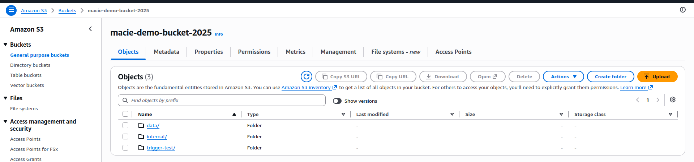
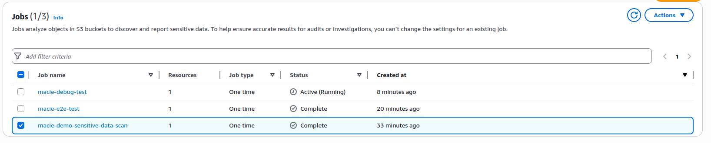
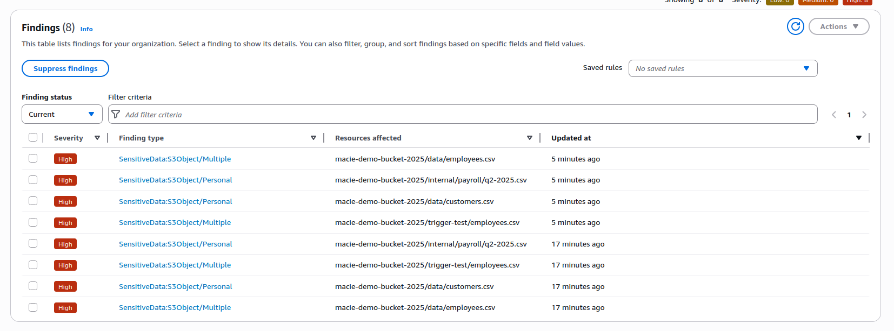
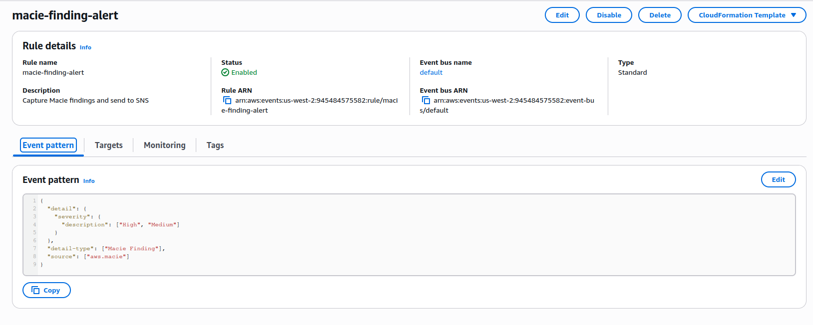
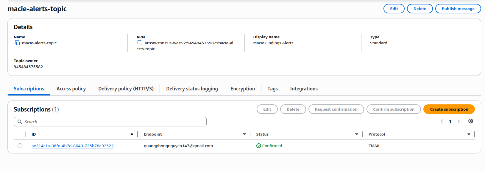
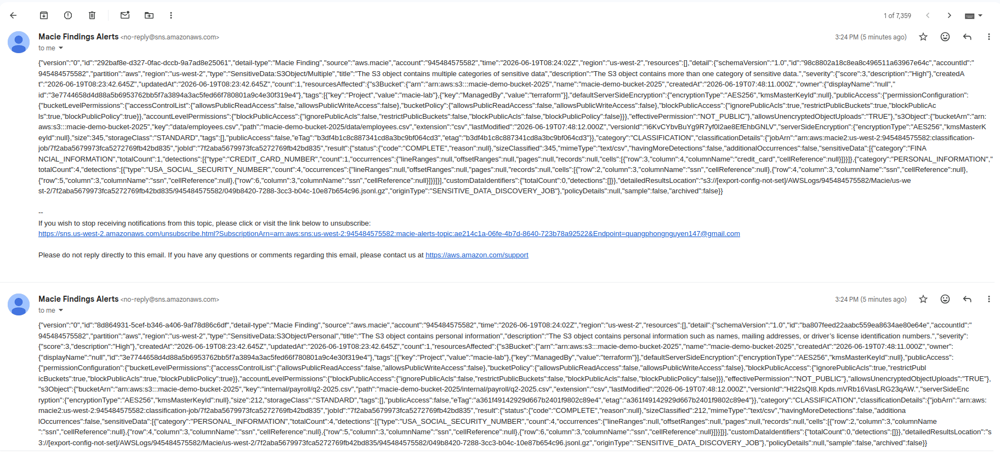

# Lab — Detect Sensitive Data in S3 with Amazon Macie

## Evidence

### 1. S3 Bucket with Sample Files

> Screenshot of the S3 bucket `macie-demo-bucket-2025` showing uploaded CSV/txt files with mock sensitive data.

---

### 2. Macie Classification Job — Configured & Completed

> Screenshot of the Macie classification job in "Complete" status, confirming the scan ran successfully.

---

### 3. Macie Findings

> Screenshot of the Macie console showing the list of findings (SSN, credit card, email) detected in the sample files.

---

### 4. EventBridge Rule

> Screenshot of the EventBridge rule `macie-finding-alert` showing the Macie event pattern and the SNS topic target.

---

### 5. SNS Subscription — Confirmed

> Screenshot of the SNS subscription in "Confirmed" status for the email endpoint.

---

### 6. Email Alert Received

> Screenshot of the actual alert email received from SNS, proving the full pipeline worked.

