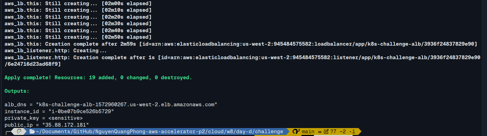
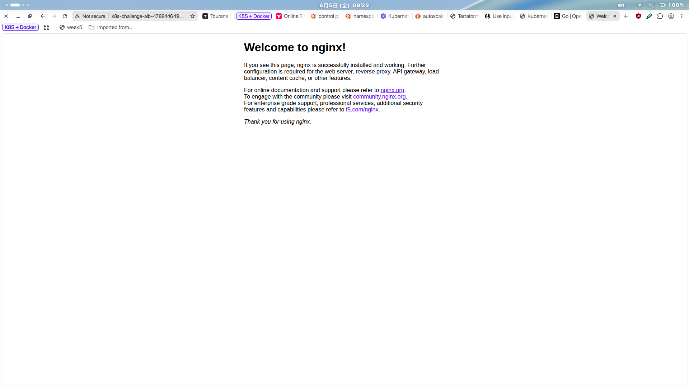
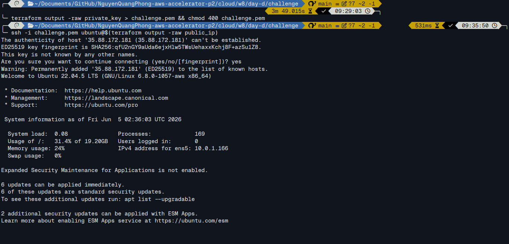
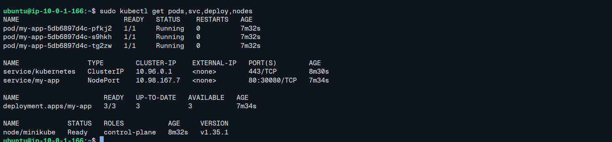
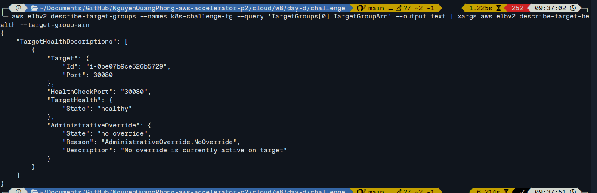
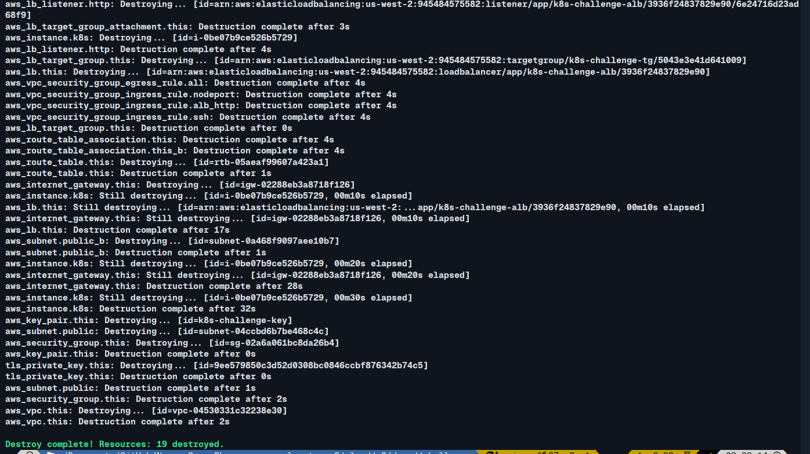

# Evidence - K8s on AWS Terraform 1-Click

## Deliverables

- Repo Terraform đầy đủ trong folder `challenge`.
- `README.md` đầy đủ hướng dẫn.
- Bằng chứng app chạy qua ALB (ảnh).
- Bằng chứng destroy sạch.

## Lệnh Chạy

Chạy từ folder `cloud/w8/day-d/challenge`:

```bash
terraform init
terraform apply
```

Lấy URL ALB:

```bash
curl http://$(terraform output -raw alb_dns)
```

Destroy:

```bash
terraform destroy
```

## Bằng Chứng

### 1. Terraform Apply Thành Công

Chụp terminal có output `Apply complete` và các outputs.



### 2. URL ALB Mở Được App

Lấy URL trên

Bằng chứng browser:



### 3. App Thực Sự Chạy Trong Kubernetes

SSH vào EC2 để kiểm tra:

```bash
terraform output -raw private_key > challenge.pem && chmod 400 challenge.pem
ssh -i challenge.pem ubuntu@$(terraform output -raw public_ip)
```

Kiểm tra cluster:

```bash
sudo kubectl get nodes
sudo kubectl get pods
sudo kubectl get svc
sudo kubectl get deploy
```

Bằng chứng (output các lệnh trên trong EC2):



### 4. ALB Forward Vào NodePort

Port matching:

```text
ALB :80 → EC2 :30080 → socat port forward → Minikube IP :30080 → Service NodePort :30080 → Pod :80
```

Các nơi dùng chung port `30080`:
- ALB Target Group port
- EC2 Security Group ingress
- `socat` listen và forward port
- Kubernetes Service `nodePort`

Bằng chứng Target Group Healthy:

```bash
aws elbv2 describe-target-health --target-group-arn $(terraform output -raw tg_arn)
```



### 5. Destroy Sạch

Chạy:

```bash
terraform destroy -auto-approve
```

Bằng chứng terminal báo `Destroy complete!`:



## Provider Wire

Providers được dùng trong cùng cấu hình Terraform:
- `hashicorp/aws`
- `hashicorp/tls`
- `hashicorp/cloudinit`

Wire:

```text
tls_private_key.this.public_key_openssh
→ aws_key_pair.this.public_key
→ aws_instance.k8s.key_name
```

```text
data.cloudinit_config.bootstrap.rendered
→ aws_instance.k8s.user_data_base64
```


## Why I Chose This Design (Not That)

| Quyết định | Chọn | Không chọn | Lý do |
|------------|------|------------|-------|
| **K8s distribution** | Minikube | EKS / k3s / kind | Minikube là K8s distribution nhẹ nhất chạy single-node trên EC2 t3.medium (4GB RAM). EKS cần nhiều node + ~$73/tháng. k3s cũng nhẹ nhưng Minikube quen thuộc hơn với môi trường lab |
| **Container runtime** | Docker driver | none driver | Docker driver không cần VM layer, tiết kiệm RAM. `--driver=none` chạy trực tiếp trên host dễ gây lỗi dependency |
| **App deployment** | `kubectl apply` trong user_data | Kubernetes provider | K8s cluster không tồn tại khi Terraform chạy → "Chicken-and-Egg". Script trong user_data đảm bảo app deploy sau khi cluster ready |
| **Port exposure** | socat TCP forward | none driver / hostNetwork | Minikube v1.38+ docker driver không expose NodePort ra host. HostNetwork cần chỉnh sửa K8s config phức tạp. Socat là giải pháp 1 dòng đơn giản |
| **Process manager** | systemd service | nohup / rc.local | Systemd auto-restart khi crash, auto-start khi reboot. Nohup chết sau reboot. Systemd là best practice trên Ubuntu |
| **Provider for SSH key** | `tls` (output private_key) | `local_file` provider | Không cần file PEM trên disk — Terraform output `sensitive = true` an toàn hơn. `local_file` ghi key xuống máy có nguy cơ lộ |
| **Provider for user_data** | `cloudinit` | `local_file` + `filebase64()` | Cloudinit tự động gzip + base64 + MIME. Nếu dùng `filebase64()` phải làm thủ công gzip |
| **App image** | nginx:alpine | Counter-app từ Docker Hub | nginx:alpine là image chuẩn, kích thước nhỏ (~23MB), dễ debug với curl. Counter-app cần hiểu code Python |
| **Replicas** | 3 | 1 | 3 replicas cho phép rolling update zero-downtime + chịu lỗi 1 pod. Vẫn vừa vặn trong t3.medium |
| **Health checks** | livenessProbe + readinessProbe | Không dùng | Liveness = K8s restart pod nếu die. Readiness = K8s ngừng gửi traffic vào pod đang lỗi. Cả 2 đều cần cho production |
