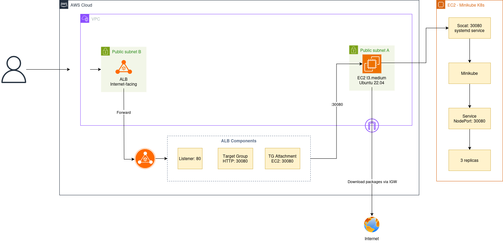
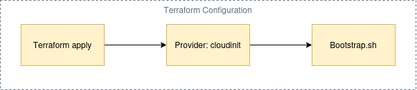

# Tuần 8 Challenge: K8s on AWS (Terraform 1-Click)

## 1. Hướng dẫn chạy (How to run)

1. Đảm bảo bạn đã cài đặt `terraform` và `aws cli`, đồng thời đã cấu hình AWS Credentials (`aws configure`).
2. Kiểm tra AWS credentials:
   ```bash
   aws sts get-caller-identity
   ```
3. Di chuyển vào thư mục chứa code hạ tầng:
   ```bash
   cd cloud/w8/day-d/challenge
   ```
4. Khởi tạo Terraform:
   ```bash
   terraform init
   ```
5. (Optional) Xem trước resources sẽ được tạo:
   ```bash
   terraform plan
   ```
6. Chạy lệnh tạo toàn bộ hạ tầng (1-click):
   ```bash
   terraform apply
   ```
7. Đợi khoảng 3-5 phút để EC2 cài đặt Minikube và deploy ứng dụng. Truy cập vào đường link ALB được in ra ở Terminal để xem kết quả.

## 2. Cách kiểm tra (How to verify)

1. Sau khi lệnh `terraform apply` kết thúc thành công, Terminal sẽ in ra Output có tên là `alb_dns` (Ví dụ: `k8s-challenge-alb-xxxxx.us-west-2.elb.amazonaws.com`).
2. Dùng curl hoặc trình duyệt để kiểm tra:
   ```bash
   curl http://$(terraform output -raw alb_dns)
   ```
3. Nếu thấy giao diện ứng dụng **nginx** hiện lên, quá trình triển khai đã thành công.

## 3. Lệnh dọn dẹp (How to destroy)

Để tránh phát sinh chi phí AWS, sau khi test xong hãy dọn dẹp toàn bộ hạ tầng bằng lệnh:

```bash
cd cloud/w8/day-d/challenge
terraform destroy
```

## 4. Sơ đồ kiến trúc (Architecture)



```text
User (Internet)
   │
   ▼
[ AWS ALB ] (Port 80)
   │
   ▼
[ Target Group ] (Port 30080 - Health Check)
   │
   ▼
[ EC2 Instance t3.medium ] (Port 30080 - Security Group)
   │  (socat systemd service - TCP forward)
   ▼
[ Minikube Node ] (Docker container - Port 30080)
   │
   ▼
[ K8s Service NodePort ]
   │
   ▼
[ Pod nginx:alpine ] (3 replicas, livenessProbe + readinessProbe)
```

Khi chạy `terraform apply`, Terraform chạy CloudInit để gắn script `bootstrap.sh` vào EC2 instance.


## 5. Cách kết nối các Provider (Wiring Providers)

Trong bài tập này, tôi đã sử dụng 3 provider khác nhau và kết nối chúng (wiring) để hoàn thành yêu cầu:

1. **`hashicorp/tls`**: Sinh ra một cặp khóa Private/Public key ngẫu nhiên (RSA 4096).
2. **`hashicorp/aws`**: Lấy Public Key từ provider `tls` truyền vào để tạo EC2 Key Pair trên AWS. Đồng thời tạo toàn bộ hạ tầng: VPC, subnet, IGW, route table, Security Group, EC2, ALB, Target Group.
3. **`hashicorp/cloudinit`**: Render file `bootstrap.sh` (chứa script cài docker/minikube/kubectl + deploy app) thành gzip + base64, gắn vào `user_data_base64` của EC2. Provider này tự động hóa việc gói script mà không cần làm thủ công.

Việc lấy Output của provider này làm Input cho provider khác đã chứng minh được khả năng sử dụng nhiều provider phối hợp cùng nhau trong một lần chạy Terraform:

```
tls_private_key.this.public_key_openssh
  → aws_key_pair.this.public_key           (tls → aws)

data.cloudinit_config.bootstrap.rendered
  → aws_instance.k8s.user_data_base64      (cloudinit → aws)
```

Thay vì dùng `hashicorp/kubernetes` dễ gây lỗi "Chicken-and-Egg" do K8s cluster chưa tồn tại lúc Terraform chạy, tôi chọn cách dùng `cloudinit` + `user_data` script để tự động hóa việc deploy K8s YAML (Deployment + Service) sau khi EC2 boot.

## 6. Các vấn đề đã gặp (Troubleshooting)

| Vấn đề | Nguyên nhân | Giải pháp |
|--------|-------------|-----------|
| ALB 502 Bad Gateway | Thiếu egress rule trong Security Group | Thêm `aws_vpc_security_group_egress_rule` cho phép all outbound |
| ALB 502 (tiếp) | t3.small thiếu RAM (1.9GB) | Nâng instance type lên `t3.medium` (4GB) |
| ALB 502 (tiếp) | Minikube docker driver không expose NodePort ra EC2 host | Thêm `socat` TCP forward từ host:30080 → minikube:30080 |
| Terraform "0 changes" dù đã sửa bootstrap.sh | `user_data_replace_on_change` mặc định `false` | Set `= true` để force replace instance khi user_data thay đổi |
| Minikube + socat chết sau reboot | Chỉ chạy bằng `nohup` trong cloud-init (1 lần) | Tạo systemd services: `minikube.service` + `socat-nodeport.service` |
| Socat restart loop | Thiếu `HOME=/root` trong systemd unit | Thêm `Environment=HOME=/root` để minikube tìm đúng profile |
| Terraform templatefile lỗi | `${MINIKUBE_IP}` bị Terraform hiểu là template variable | Dùng `$$` escape: `$${MINIKUBE_IP}` → `${MINIKUBE_IP}` cho bash |

## 7. File structure

```
challenge/
├── main.tf              # Terraform resources (VPC, EC2, ALB, SG, ...)
├── variables.tf         # Input variables (region, instance_type, ...)
├── outputs.tf           # Outputs (alb_dns, public_ip, private_key, ...)
├── bootstrap.sh         # Cloud-init script (install + minikube + deploy app)
├── versions.tf          # Provider versions
├── .gitignore           # Ignore .terraform, *.tfstate, *.pem
└── app/
    ├── deployment.yaml  # K8s Deployment (nginx:alpine, 3 replicas)
    └── service.yaml     # K8s Service (NodePort 30080)
```

## 8. Connecting to ALB Address via Browser

