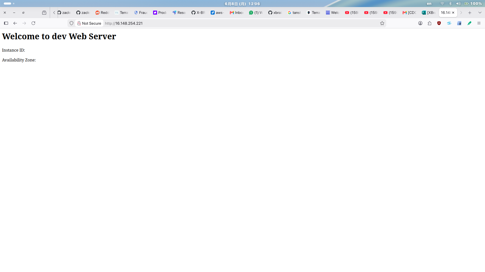

# WebApp Infrastructure

Terraform project deploying VPC, EC2, RDS MySQL, and S3 on AWS.

## Prerequisites

- Terraform >= 1.3
- AWS credentials configured (`~/.aws/credentials` or `AWS_ACCESS_KEY_ID`/`AWS_SECRET_ACCESS_KEY` env vars)
- An SSH key pair (optional, for EC2 access)

## Setup

### 1. Bootstrap State Backend (one-time only)

Creates S3 bucket + DynamoDB table for remote state locking.

```bash
cd backend
terraform init
terraform apply
cd ..
```

If you modified `backend/variables.tf`, update `backend.hcl` to match your bucket and table names.

### 2. Configure Variables

Edit `terraform.tfvars` (already included with placeholders):

```hcl
s3_bucket_name   = "your-globally-unique-assets-bucket"
allowed_ssh_cidr = "YOUR_PUBLIC_IP/32"   # e.g. "203.0.113.42/32"
environment      = "dev"
```

### 3. Deploy

```bash
terraform init -backend-config=backend.hcl
terraform plan
terraform apply
```

### 4. Access

```bash
terraform output ec2_public_ip
```

Open `http://<ip>` in a browser.

## Destroy

```bash
# Disable deletion protection for RDS first
terraform apply -var="rds_deletion_protection=false"

# Destroy everything
terraform destroy
```

# RESULT

