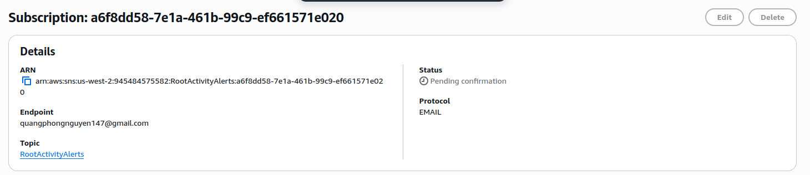
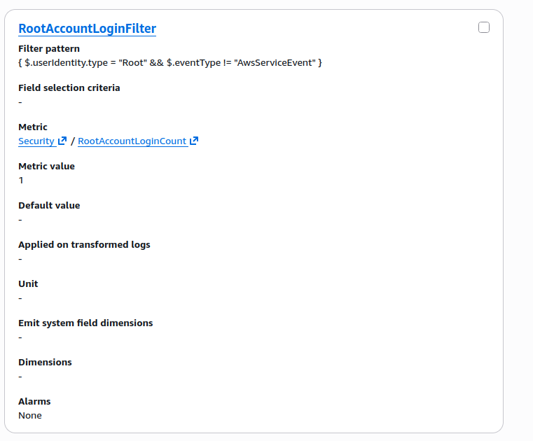
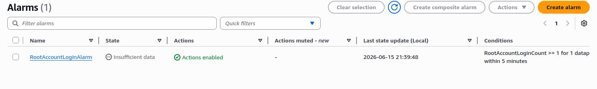
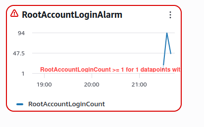
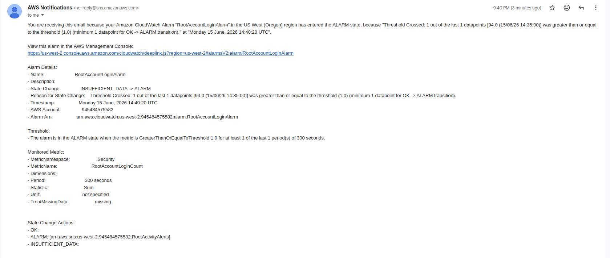

## First, we create SNS Subscription to send notifications to our email.

## Then we create Log Group and Alarm

## Finally, we create CloudWatch Dashboard

## RESULT when the alarm is triggered

